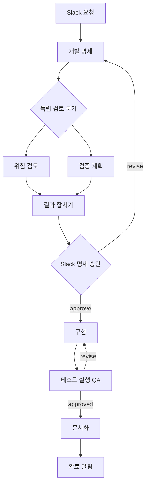

# Slack 개발 워크플로 예제

[agentworkflow](https://github.com/jisung-02/agentworkflow)의 YAML 정의를 GitHub에서 받아 Slack slash command로 실행하는 예제입니다. [참고 영상의 개발 워크플로 구간](https://www.youtube.com/watch?v=woSiT_kytXo&t=977s)에 나오는 명세, 독립 검토, 구현, QA 재작업, 문서화 흐름을 현재 엔진의 기능으로 구성했습니다. 영상의 대화형 마스터 AI를 그대로 복제한 것은 아닙니다. 이 예제의 Slack 입구는 `/agentflow` 명령입니다.



`slack-dev-cycle`은 Codex CLI로 구현·문서화를 수행합니다. 승인 전 명세 작성과 독립 검토는 `codex-review` runner가 읽기 전용 sandbox에서 수행합니다. QA는 테스트 실행을 위해 `codex-qa` runner를 사용합니다. 실행 중 Git 작업 트리가 바뀌면 결과를 `blocked`로 처리합니다. 그래프의 두 검토 branch는 독립 토큰과 worktree를 갖고 분기 시작 시점의 공통 출력만 각각 받습니다. 현재 기본 worker는 이 토큰을 순서대로 실행합니다. 사람의 승인과 장애 처리에는 Slack 응답이 필요합니다. 명세와 구현의 재시도 횟수는 YAML의 `max_visits`로 제한합니다.

병렬 검토 worktree는 대상 저장소의 커밋된 `HEAD`에서 만들어집니다. 대상 저장소에 있던 미커밋 변경은 이 두 branch에 복사되지 않습니다. 구현과 QA는 대상 프로젝트의 작업 디렉터리를 사용합니다.

## 1. GitHub에서 정의 받기

`uv`, `git`, 로그인된 `codex` CLI와 작업 대상 Git 저장소가 필요합니다. `WORKFLOW_PROJECT_DIR`은 실제로 수정할 프로젝트의 절대 경로입니다. 예제 정의 저장소와 구분해서 설정하세요.

```bash
git clone https://github.com/jisung-02/agentworkflow-example.git
cd agentworkflow-example
uv venv .venv
uv pip install --python .venv/bin/python \
  'workflow-engine-local[channels] @ git+https://github.com/jisung-02/agentworkflow.git'
codex login
./.venv/bin/workflow validate definitions/slack-dev-cycle.yaml
./.venv/bin/workflow validate definitions/slack-smoke.yaml
```

정의를 수정해 GitHub에 푸시한 뒤 운영 머신에서 `./scripts/sync.sh`를 실행하면 fast-forward pull과 YAML 검증이 이뤄집니다. 새 실행은 갱신된 정의를 읽고, 이미 시작된 실행은 SQLite에 저장된 정의 스냅샷을 사용합니다. 운영 중인 HTTP·worker 프로세스를 다시 띄울 필요는 없습니다.

## 2. Slack 앱 연결

Slack 앱에 `/agentflow` slash command를 만들고 Request URL을 공개 HTTPS 주소의 `/slack/command`로 설정하세요. Bot Token Scopes에는 `commands`와 `chat:write`를 추가하고 앱을 워크스페이스에 설치하세요. 알림을 보낼 채널에는 봇을 초대해야 합니다. Slack의 [slash command 설정](https://docs.slack.dev/interactivity/implementing-slash-commands/)과 [메시지 전송 권한](https://docs.slack.dev/reference/methods/chat.postMessage/)을 참고하세요.

로컬 HTTP 서버는 `127.0.0.1:8080`에서 실행됩니다. Slack이 접근할 수 있도록 유효한 HTTPS 주소로 전달하는 터널 또는 리버스 프록시가 필요합니다. 그 주소의 `/slack/command`를 Request URL로 등록하세요.

두 프로세스가 같은 설정을 읽도록 `.env` 파일을 만듭니다. 값은 로컬에서만 보관하고 Git에 커밋하지 마세요.

```bash
cp .env.example .env
chmod 600 .env
# .env를 열어 예제 저장소와 다른 대상 프로젝트 경로, Slack 사용자 ID,
# Signing Secret, Bot Token을 채우세요.
```

첫 터미널에서 `./scripts/serve.sh http`, 두 번째 터미널에서 `./scripts/serve.sh worker`를 실행합니다. `http`는 서명과 허용 사용자를 확인해 명령을 접수하고, `worker`는 SQLite에서 작업을 진행하고 대기·완료 알림을 보냅니다. 두 프로세스는 기본적으로 대상 프로젝트의 `.workflow/state.db`를 공유합니다. 다른 경로를 쓰려면 양쪽에 같은 `WORKFLOW_DB`를 설정하세요.

## 3. 먼저 Slack 왕복 확인

`slack-smoke`는 모델을 호출하지 않습니다. Slack에서 다음 순서로 실행해 연결, 대기 알림, 사람의 응답, 완료 알림을 확인하세요.

```text
/agentflow run slack-smoke request="연결 확인"
/agentflow status RUN_ID
/agentflow respond TOKEN_ID approve
```

첫 명령의 응답에 `RUN_ID`가 표시됩니다. worker가 대기 상태에 도달하면 같은 채널에 프롬프트와 `TOKEN_ID`를 보냅니다. 승인 후에는 완료 알림이 옵니다. Slack 명령의 즉시 응답은 명령을 보낸 사람에게만 보이고, worker의 알림은 봇 메시지로 채널에 게시됩니다.

## 4. 개발 워크플로 실행

```text
/agentflow run slack-dev-cycle request="로그인 오류 메시지를 사용자에게 더 명확하게 보여줘"
/agentflow status RUN_ID
/agentflow respond TOKEN_ID approve
```

`status`는 현재 상태와 결과 요약을 보여줍니다. 명세 승인 알림에 들어 있는 `TOKEN_ID`를 사용해 `approve`, `revise`, `reject` 중 하나로 답하세요. QA가 `revise`를 반환하면 구현으로 돌아가고, 횟수 한도를 넘기면 `needs_attention`이 됩니다. 자동 작업이 막히면 별도의 대기 메시지가 오며 `retry` 또는 `stop`으로 답합니다.

전체 결과와 Artifact 경로는 예제 저장소에서 다음처럼 조회합니다. 스크립트가 `.env`의 대상 프로젝트와 DB 경로를 읽습니다.

```bash
./scripts/status.sh RUN_ID
```

QA는 쓰기 가능한 sandbox에서 테스트를 실행합니다. Git에서 추적 중인 파일이나 무시되지 않은 새 파일이 바뀌면 자동으로 `blocked` 처리하고 변경 사항은 확인할 수 있게 남깁니다. `needs_attention`이 runner 오류라면 엔진 CLI의 `workflow resume RUN_ID`로 같은 실행을 재시도할 수 있습니다. 전이 횟수 초과는 `resume`으로 해제되지 않으며 정의의 방문 상한을 조정한 뒤 새 실행이 필요합니다. 예제는 변경 사항을 자동 커밋하거나 원격에 푸시하지 않습니다. 실제 Slack 자격 증명과 Codex 모델을 이용한 전체 실행은 각자의 환경에서 확인해야 합니다.

## 정의 바꾸기

- [`definitions/slack-dev-cycle.yaml`](definitions/slack-dev-cycle.yaml): 노드, 전이, 재작업 횟수
- [`definitions/instructions/`](definitions/instructions/): 노드별 지침
- [`definitions/slack-smoke.yaml`](definitions/slack-smoke.yaml): 외부 모델 없이 연결을 확인하는 정의

YAML을 바꾼 뒤 `./.venv/bin/workflow validate definitions/slack-dev-cycle.yaml`로 검사하세요. `./.venv/bin/workflow graph definitions/slack-dev-cycle.yaml`은 Mermaid 상태도를 출력합니다. 명령·YAML 형식의 자세한 설명은 [엔진 README](https://github.com/jisung-02/agentworkflow#readme)를 참고하세요.
